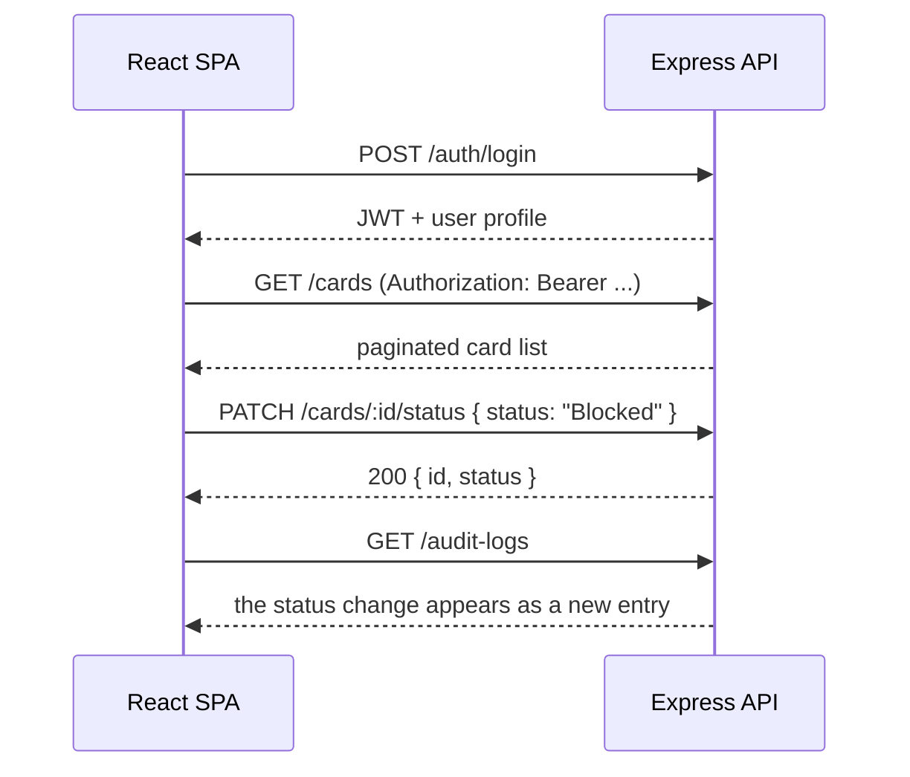

# API Flow & Endpoint Reference

Live Swagger UI is served at `http://localhost:4000/api-docs` when the backend is running (spec
source: `backend/src/openapi.ts`, raw JSON at `/api/openapi.json`). This document is a companion
to that, not a replacement - it adds the request-flow context that a Swagger page doesn't show
well. All endpoints are prefixed with `/api` and, except `/auth/login`, `/auth/refresh`,
`/auth/logout` and `/health`, require `Authorization: Bearer <token>`.

## Auth

| Method | Path | Role | Description |
|---|---|---|---|
| POST | `/auth/login` | Public | Returns a 15-min access token + a 7-day refresh token + user profile. Rate-limited to 10 attempts/min/IP. |
| POST | `/auth/refresh` | Public | Exchanges a valid refresh token for a new access+refresh pair. Rotates the token (old one revoked immediately) so it can't be replayed. Rate-limited alongside login. |
| POST | `/auth/logout` | Public | Revokes the given refresh token. The access token simply expires on its own. |

## Cards

| Method | Path | Role | Description |
|---|---|---|---|
| GET | `/cards` | Both | List cards. Admins see all (search/filter/paginate); cardholders see only their own. |
| GET | `/cards/:id` | Both | Card detail + status history. Cardholders can only fetch their own card. |
| POST | `/cards` | Admin | Issue a new card to a cardholder. |
| PATCH | `/cards/:id/status` | Admin | Transition status (Active/Blocked/Suspended/Closed) with a server-enforced state machine. |

## Wallet

| Method | Path | Role | Description |
|---|---|---|---|
| GET | `/wallet/:cardId/balance` | Both | Balance enquiry (itself logged as a transaction). |
| POST | `/wallet/:cardId/load` | Admin | Load funds. Supports `idempotencyKey` to ignore duplicate submits. |
| POST | `/wallet/:cardId/debit` | Both | Debit funds (e.g. a purchase). Runs the fraud engine, declines on insufficient funds or inactive card. |
| POST | `/wallet/:cardId/refund` | Admin | Refund a prior transaction amount back onto the card. |

## Transactions

| Method | Path | Role | Description |
|---|---|---|---|
| GET | `/transactions` | Both | Search/filter by card number, reference, merchant, status, date range. Paginated. |

## Fraud

| Method | Path | Role | Description |
|---|---|---|---|
| GET | `/fraud-alerts` | Admin | List alerts, filterable by severity/resolved state. |
| PATCH | `/fraud-alerts/:id/resolve` | Admin | Mark an alert as resolved. |

## Reports

| Method | Path | Role | Description |
|---|---|---|---|
| GET | `/reports/transactions?format=csv\|json` | Admin | Full transaction export. |
| GET | `/reports/fraud?format=csv\|json` | Admin | Fraud alert export. |
| GET | `/reports/cards?format=csv\|json` | Admin | Card + balance export. |
| GET | `/reports/daily-summary?format=csv\|json` | Admin | Spend/loads/declines grouped by day. |

## Notifications

| Method | Path | Role | Description |
|---|---|---|---|
| GET | `/notifications` | Both | Latest 50 notifications for the logged-in user. |
| PATCH | `/notifications/:id/read` | Both | Mark a notification as read. |

## Audit

| Method | Path | Role | Description |
|---|---|---|---|
| GET | `/audit-logs` | Admin | Paginated audit trail of sensitive actions (login, card issuance, status changes, loads, refunds). |

## Users

| Method | Path | Role | Description |
|---|---|---|---|
| GET | `/users/cardholders?search=` | Admin | Lookup list used by the "issue card" picker. |

## A typical end-to-end flow

