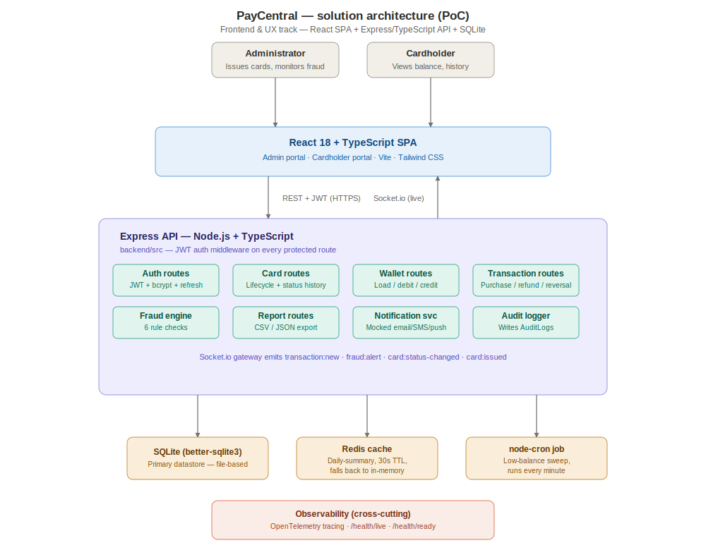
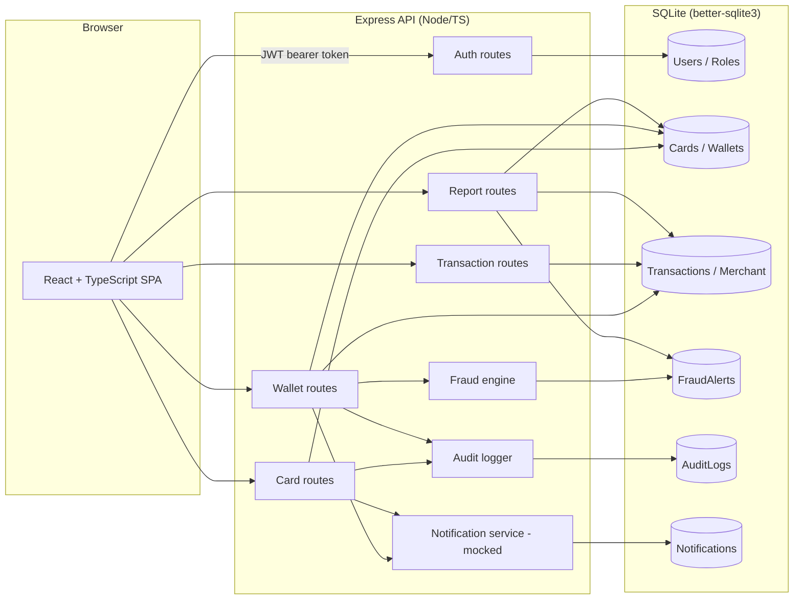
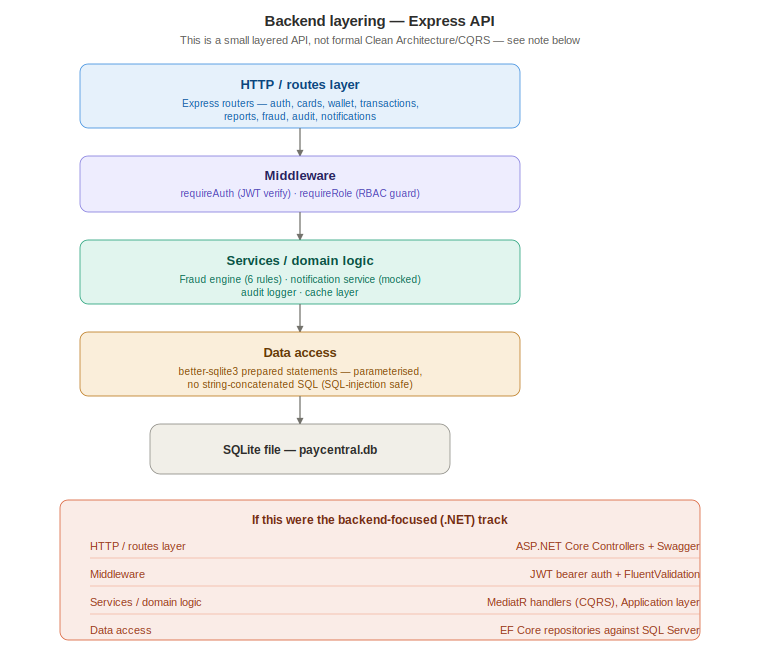
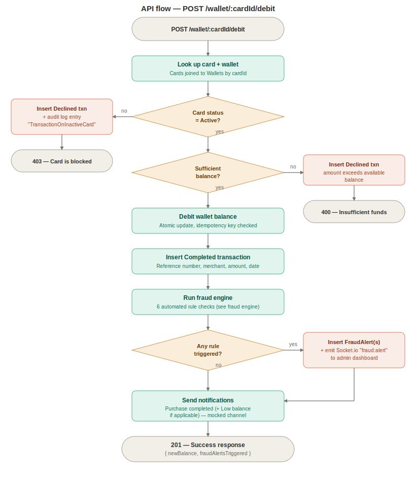
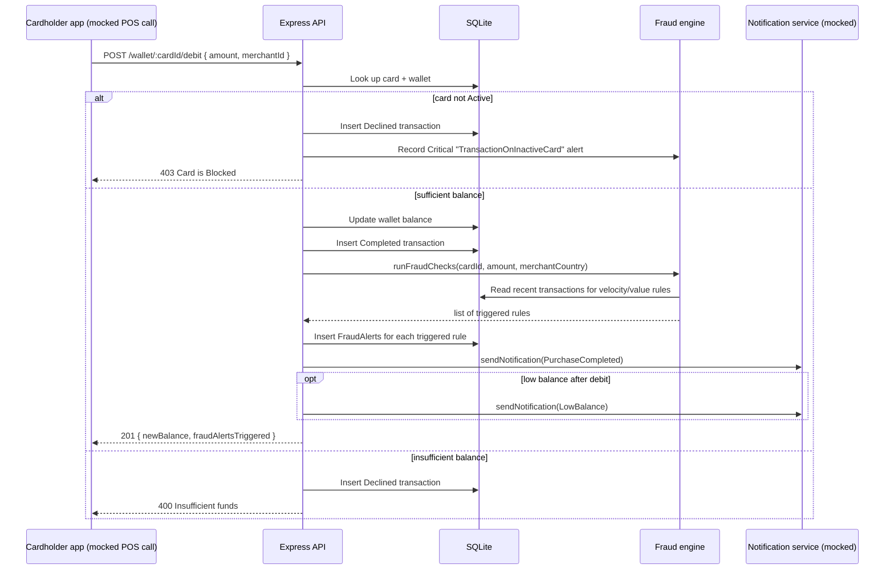

# Architecture

## Why this shape

This was built for the **Frontend & UX Focus** track. Most of the engineering depth in this
submission is in the React client: component structure, state, routing, accessibility and the
admin/cardholder UX. The backend exists to give that frontend something real to talk to — it is a small, honest Express + SQLite API, not a disguised attempt at the full .NET/Clean Architecture stack described for the backend track. I'd rather submit a working, well-reasoned Node API than a half-finished .NET solution I didn't have time to get right. See `docs/AI-USAGE.md` and the root README "Assumptions" section for the full reasoning.

If I were doing the backend-focused track instead, this would be a .NET 8 Web API with Clean
Architecture (Domain / Application / Infrastructure / API layers), MediatR for CQRS, EF Core
against SQL Server, and FluentValidation at the API boundary.

## High-level component diagram



<details>
<summary>Mermaid source (renders natively on GitHub)</summary>



</details>

## Backend layering



## Request flow: a card purchase



<details>
<summary>Mermaid sequence diagram source (renders natively on GitHub)</summary>



</details>

*Colour key for both diagrams: gray is a neutral/structural step, teal is the API processing
layer (and the success path on the second diagram), amber is the data/storage layer (and
notifications), coral marks the two decline outcomes.*

## Frontend structure

```
frontend/src/
  api/client.ts        - thin fetch wrapper, attaches JWT, handles 401 redirect
  context/AuthContext   - login/logout/session restore
  components/           - AppShell (sidebar nav), Badge, Pagination, EmptyState, etc.
  pages/admin/           - 6 screens: overview, cards, card detail, transactions, fraud, reports, audit
  pages/cardholder/      - 3 screens: home, transactions, notifications
```

Routing is role-gated client-side (`ProtectedRoute`) and the API independently enforces role checks server-side - the frontend gate is a UX nicety, not the security boundary.

## Scaling notes (for the second-round discussion)

At higher scale the obvious next moves: move the fraud rule checks off the request path into a queue/worker (Azure Service Bus or similar) so a purchase isn't blocked on rule evaluation; replace SQLite with a managed Postgres/SQL Server instance with read replicas for reporting queries; add Redis for session/rate-limit state once this runs across more than one API instance; and put the SPA behind a CDN with the API behind a load balancer.
