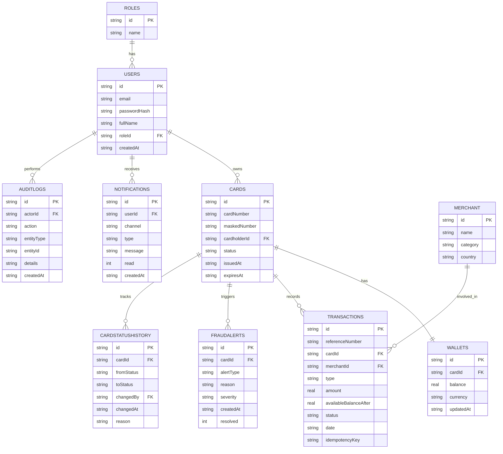

# Database / ER Diagram

SQLite via `better-sqlite3` for the PoC (zero setup, file-based, easy to inspect). The schema is written so it maps cleanly onto SQL Server + EF Core migrations if/when this moves to the full.NET stack - see `backend/src/db/index.ts` for the actual `CREATE TABLE` statements.

## Design notes / things I'd reconsider with more time

- `cardNumber` is stored in clear text for this PoC so search-by-card-number works without a
  tokenisation service. In a real build this would be encrypted at rest (or tokenised via a PCI vault) with only the masked number queryable directly - flagged in the README "Assumptions".
- IDs are UUID strings rather than auto-increment ints, mainly to avoid leaking row counts/order through the API and to make merging/seeding data simpler.
- `idempotencyKey` on `Transactions` is how duplicate purchase/load requests are caught (see
  Functional Requirements -> Validation -> "Prevent duplicate requests").
